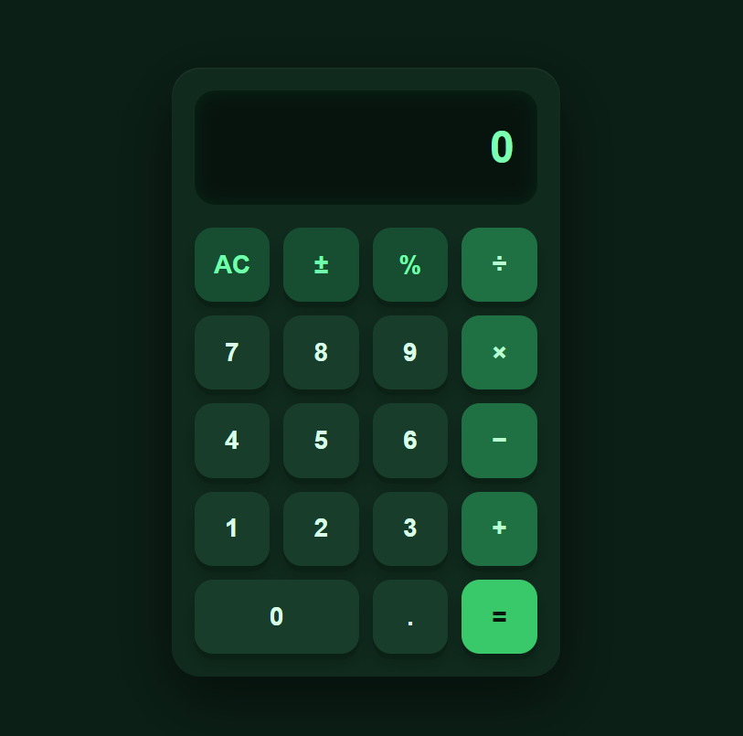

Green Calculator

This is a basic calculator front-end made using HTML and CSS.

Features
Green-themed calculator design
Simple and clean layout
Calculator buttons for numbers and operators
Separate HTML and CSS files
No JavaScript or calculation functions
Files
index.html – contains the calculator structure
style.css – contains the design and styling
Note

This project is only the front-end of a calculator. The buttons are for display only and do not perform calculations.

Below is the image

